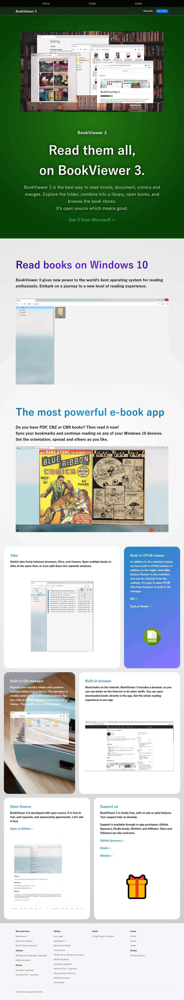

# BookViewerApp3-Pages
Separate repository for the fruity [introduction page](https://kurema.github.io/BookViewerApp3/introduction.en.html) of [BookViewer 3](https://github.com/kurema/BookViewerApp3). 

The content here is pushed to gh-pages branch of kurema/BookViewerApp3 using GitHub Actions [workflow](.github/workflows/sync.yml).

## Pexels
Some of the images are from [Pexels](https://www.pexels.com/). See the [license](https://www.pexels.com/license/).

## CC0
Other files are licensed under CC0.

## Supported browsers
Latest Chrome and Chromium Edge works fine, FireFox has a tiny issue (`backdrop-filter` does not work in Feb 2021), Edge (including built-in browser of BookViewer 3) is terrible. WinUI 3.0 with WebView2 should be fine, which future release of BookViewer 3 will use.

## Screenshot
You can just [visit](https://kurema.github.io/BookViewerApp3/introduction.en.html).

